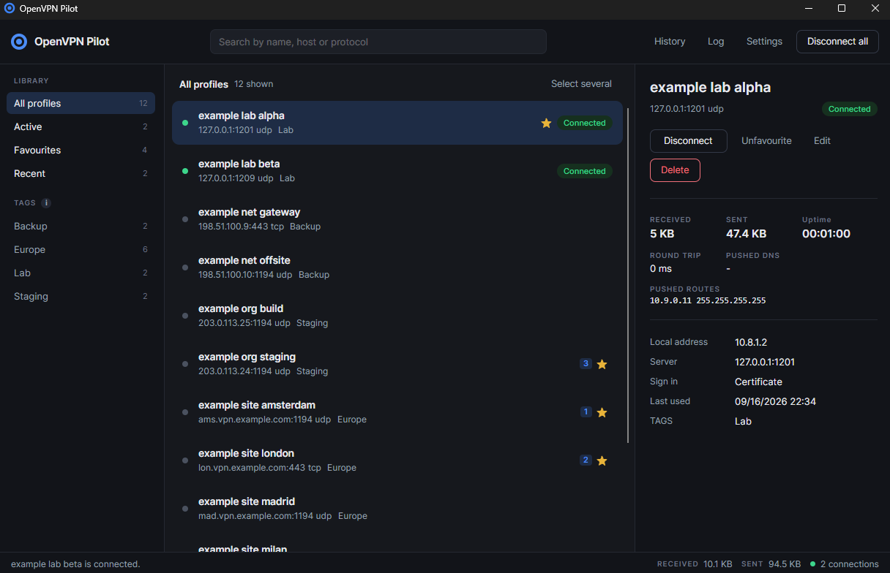

# OpenVPN Pilot

A desktop client for OpenVPN built for people who manage a lot of profiles.

The stock OpenVPN GUI on Windows is a tray icon with a flat, unsearchable list. That works for two or
three connections. It stops working somewhere around twenty. OpenVPN Pilot keeps the proven OpenVPN
process doing the tunnelling and replaces the interface around it.

It runs on Windows and on macOS. Both drive the same `openvpn` through its management interface; what
differs is the privileged part that starts it, which on Windows is OpenVPN's own interactive service
and on macOS is this project's helper, because macOS has no equivalent.

The compact form stays where a name has to be one word: the executable is `OpenVpnPilot.exe`, the
installation directory and the data directory are `OpenVpnPilot`, and the companion command is
`ovp`. On macOS the bundle is `OpenVPN Pilot.app`, because the Finder labels an application with its
file name and with nothing else.

> **Status: version 1.3.0.** The integration layer and the interface are proven end to end against
> OpenVPN Community 2.7.6 and against the ten server lab in this repository. Builds are unsigned by
> choice. See [Roadmap](#roadmap).

*Sample profiles. The hosts are invented and the addresses come from the documentation ranges.*

## Documentation

The rest is one page per subject, so this one stays short:

| | |
| --- | --- |
| [Windows](docs/windows.md) | What it needs, installing it, deploying it with group policy, and what it writes |
| [macOS](docs/macos.md) | What it needs, the helper package, Gatekeeper, and what it writes |
| [Using it](docs/usage.md) | Tags and favourites, several tunnels at once, languages, what reaches OpenVPN |
| [The `ovp` command](docs/cli.md) | The companion command, and driving the application from other software |
| [Working on it](docs/development.md) | Architecture, building, the artwork, the ten server test lab, contributing |
| [Changelog](CHANGELOG.md) | What changed in each version |

## Features

- Instant search across profile name, tag and remote host
- A quick switcher: one global shortcut, type a few letters, press return. Return connects and
  leaves you where you were; control and return brings the window up as well
- The same palette for stopping: one shortcut lists what is running, space ticks several, return
  disconnects them
- Checkboxes on demand, to connect, disconnect or delete a set of profiles together
- Tags and favourites with numbered slots bound to shortcuts
- Global shortcuts for connect, reconnect, disconnect and the favourite slots
- Several tunnels connected at once, each with its own live telemetry
- Live figures per tunnel: throughput, uptime, round trip, assigned address, pushed routes and DNS
- Credentials kept in the operating system keystore, never in a file on disk
- One time codes, both the kind presented up front and the kind raised after a refusal
- Session history with durations and transfer volumes, exportable as CSV and clearable by filter
- A live log window carrying both this application's own record and OpenVPN's, filterable by source,
  level and text, written to one file per day and kept for as long as you say
- Bulk import from files, folders and ZIP archives, plus watched folders that keep profiles in sync
- Opening a `.ovpn` file from the shell brings up the import wizard with it, once you have picked
  this application in the Open with menu
- Export as plain configurations, or as an encrypted `.ovppkg` package for another machine, which
  can carry the saved sign ins so a whole set arrives ready to connect
- A command line on both the application and `ovp`, so other software can bring a tunnel up before
  it needs one
- Notifications for connected, lost, reconnecting and failed, suppressible per event
- A check at startup and before every connection that says which dependency is missing, rather than
  failing when a tunnel is asked for
- An optional check for a newer release, which reads a GitHub release list and nothing else
- The quick menus open on the display you left them on, and move between displays with alt and an
  arrow key
- Dark, light and system themes, autostart, bounded auto reconnect
- English and German, and a new language is a JSON file rather than a new build

## Installing

**Windows.** Install [OpenVPN Community](https://openvpn.net/community-downloads/) with its
interactive service, then the MSI. It puts the application under Program Files and `ovp` on PATH.
The details, including deployment with group policy, are in [docs/windows.md](docs/windows.md).

**macOS.** Open the disk image, drag the application to Applications, then install the helper
package, which brings its own OpenVPN and is the only part that asks for a password. The details,
including what Gatekeeper does with an unsigned build, are in [docs/macos.md](docs/macos.md).

Both platforms are built from this repository and neither build is code signed. Why, and what that
means when you open it, is on each platform's page.

## Roadmap

- [x] Prove the interactive service and management interface integration end to end
- [x] Solution structure and coding standards
- [x] Configuration parsing and inlining, management client, interactive service launcher
- [x] Connection supervisor, credential handling and one time codes
- [x] SQLite store, schema and profile import with duplicate detection
- [x] User interface with profile list, search, live status and notification area icon
- [x] Tags, favourites, quick switcher, import and export
- [x] Global shortcuts, notifications, telemetry and session history
- [x] Localization, settings, autostart and auto reconnect
- [x] Portable packages, watched folders and a diagnostics bundle
- [x] Installer, `ovp` on PATH, and a command line other software can drive
- [x] macOS: the helper that starts OpenVPN as root, the bundle, the disk image and the package
- [ ] An update feed

Releases are not code signed. A certificate costs money every year to tell people what the source
already tells them, so builds are unsigned: build it yourself, or accept what the system shows for
anything unsigned. What that looks like is on the [Windows](docs/windows.md) and
[macOS](docs/macos.md) pages.

There is no kill switch and none is planned. This is a client for reaching another network, not for
being an exit node, so a tunnel that drops leaks nothing that was not already going out the same way.

## Licence

MIT. See [LICENSE](LICENSE).

OpenVPN is a registered trademark of OpenVPN Inc. This is an independent client that drives the
OpenVPN Community software; it is not affiliated with, endorsed by or supported by OpenVPN Inc.
