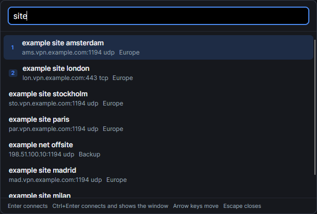
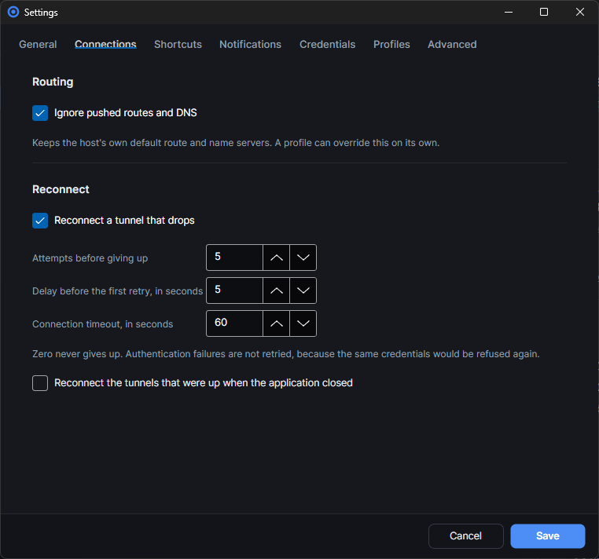

# Using OpenVPN Pilot

[OpenVPN Pilot](../README.md) · [Windows](windows.md) · [macOS](macos.md) · Using it · [The `ovp` command](cli.md) · [Working on it](development.md)

## Organising a set

There are no folders. A profile carries as many tags as it needs, the sidebar lists them, and the
search box matches a tag along with the name and the remote host. One profile can belong to as many
groupings as make sense, which a tree cannot express, and nothing has to be maintained by hand.

## Working on more than one at a time



**Select several**, above the list, puts a checkbox on every row and turns into **Done selecting**
until it is pressed again. Tick some and connect, disconnect or delete them together; **Select all
shown** ticks what the current filter and search leave visible, which is how a whole tag is brought up
in one go. Deleting asks a second time, because it is the one action here that cannot be undone.
Profiles are connected one after another rather than all at once: each tunnel is a process, an
adapter and a port, and twenty starting in the same instant is how a machine runs out of all three.

A single profile is deleted from the detail panel, which asks first and names the profile it is
about. Its notes are shown there too, under when it was last used, and can be selected and copied.

There is no built in limit on how many tunnels run at once, and ten at a time is what the lab is for.
The real limits are outside the application: one OpenVPN process and one virtual adapter per tunnel,
and the adapter pool is what runs out first. A tunnel that cannot come up is given a minute and then
abandoned, so a saturated machine reports what happened instead of leaving processes behind.

## Adding a language

Language files are JSON. The ones that ship live in `lang` beside the executable, and anything placed
in `lang` under the application data directory is layered on top of them, key by key. Copy `en.json`,
translate the values, drop it in and reload from the settings screen: no rebuild, and a key you have
not translated falls back to English rather than disappearing.

## What reaches OpenVPN

The application never edits a profile to make it work. It writes the configuration out exactly as it
was imported and puts everything it needs on the command line, so what a server sees is the
configuration you gave it plus a fixed set of options:

```
--config <file> --management 127.0.0.1 <port> stdin --management-query-passwords
--management-hold --management-forget-disconnect --auth-retry interact --verb 3
```

The verbosity is the one part of that line you can change, under **Settings, Advanced**. Three
carries the state changes, the push reply and the reason a handshake failed, which is what the
client reads and what the log window shows; raise it only while looking into something.

The management interface is how the client drives the tunnel and the only way a credential ever
reaches OpenVPN; its password is generated per connection and passed on standard input, so it never
touches disk. Nothing else is added unless it was asked for:

| Added when | Options |
| --- | --- |
| Route protection is on, per profile or for the application | `--pull-filter ignore "redirect-gateway"`, `--pull-filter ignore "dhcp-option"`, `--pull-filter ignore "block-outside-dns"` |
| A log file was asked for | `--log <file>` |

Route protection is what stops a server from taking the host's routing and DNS with it. To watch a
server that asks for all traffic do it anyway, turn it off for that one profile in the profile
editor, or for everything under **Settings, Connections**. From a terminal it is simply the option
left out:

```bash
ovp connect lab/clients/lab-09-cert.ovpn --detached --seconds 20
```

That server pushes `redirect-gateway def1`, so with protection off the host sends everything into the
tunnel for as long as it is up. Nothing else about the machine changes and it is over when the
command is, which is why a short run from a terminal is the way to look at it.



## Looking for a newer release

The application can ask GitHub whether a newer release exists. It is the only thing here that
contacts a network nobody asked it to, so it is worth saying exactly what it does:

- It reads `https://api.github.com/repos/<owner>/<name>/releases/latest`, without credentials.
- It compares the release tag with the running version and reports the result.
- It downloads nothing and installs nothing. A newer release is a notice with a link.
- On macOS the notice says so: a release carries no macOS build, and a newer version there means
  building that release from the source, which is one command.

The repository defaults to the one this project is published from, and the check is on. Both are
under **Settings, Advanced**: clearing the repository, or turning the check off, stops every request.

Release tags are `v<version>`, for example `v1.2.0`. Tags written as `version-<version>`, which is
what this project published up to 1.2.0, are read as well.
